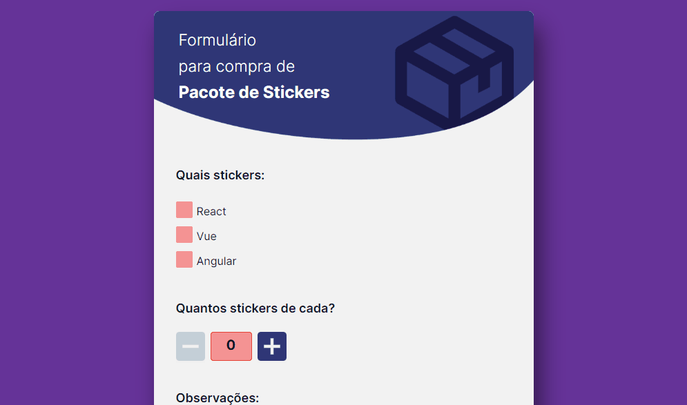

# Form react hooks formik

[Access the website](https://danieladuarteng.github.io/my-reads/)

Form building in React using hooks and formik for validate fields

## Required
[NodeJS v10.16.4 or higher](https://nodejs.org/en/)

## Installation
Open the terminal of your preference and input the commands:

`git clone https://github.com/danieladuarteng/form-react-hooks-formik.git`

`cd form-react-hooks-formik`

`npm install`

## Run:

To run the project enter:

`npm start`

## License

This project uses the license [MIT](https://choosealicense.com/licenses/mit/)
